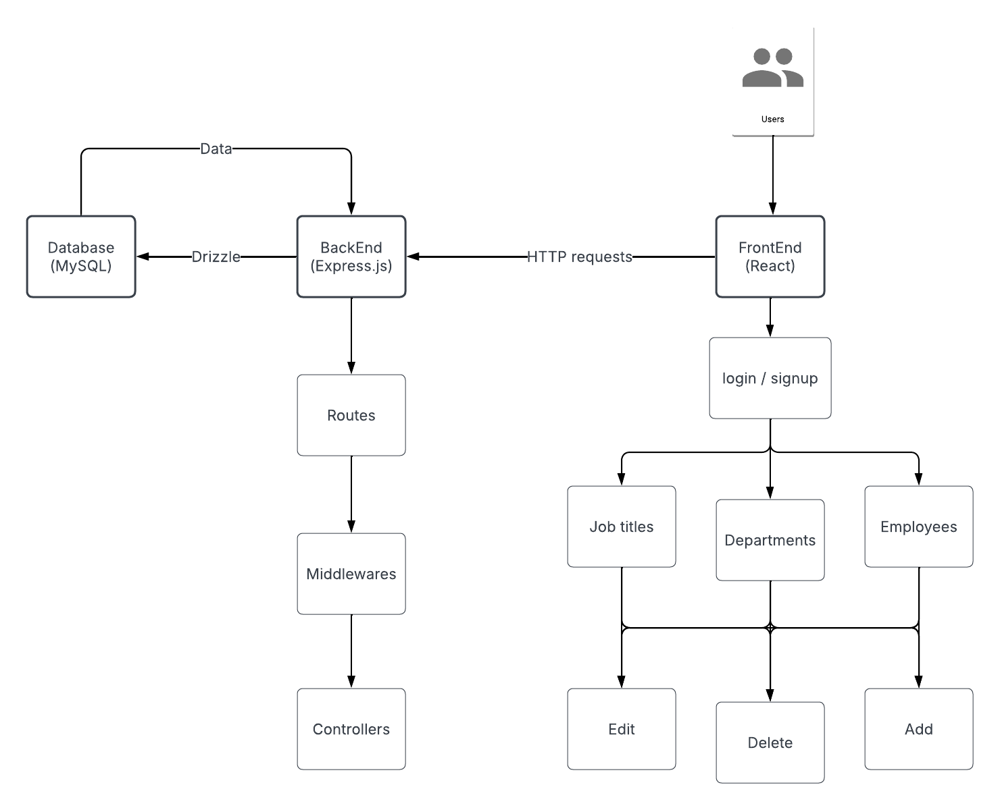

# **Employee Directory**

## Overview

An employee directory application that stores and manages employee information within an organization.
It allows HR professionals to search, view, and manage employee details including names, job titles, departments, contact information, and more.

## [Flow Chart](https://lucid.app/lucidchart/916a75b6-7552-424f-8b69-9dd0bf828ef6/view)



## Installation & Setup

### Required Prerequisites

- Node.js (Install from [nodejs.org](https://nodejs.org/))
- MySQL Server (Install from [mysql.com](https://dev.mysql.com/downloads/))
- MySQL Workbench (optional, for GUI)

### Server Setup

#### **1- Go into the server directory**

```sh
cd server
```

#### **2- Install backend dependencies**

```sh
npm install
```

#### **3- Open MySQL Workbench and create the database**

```sql
CREATE DATABASE database_name;
```

***Note**: Replace `database_name` with your preferred database name*

#### **4- Create a `.env` file in the server directory as following**

```env
DATABASE_URL = mysql://<username>:<password>@<host>:<port>/<database_name>

JWT_SECRET = your_secret_key

JWT_EXPIRES_IN = time_in_seconds
```

***Note**: Replace `<username>`, `<password>`, `<host>`, `<port>`, and `<database_name>` with your database credentials*

#### **5- Create the database tables**

```sh
npm run db:generate # Generates schema
npm run db:migrate # Applies migrations to set up tables
```

#### **6- Start the server (with nodemon)**

```sh
npm start
```

#### **7- The server should now be running at `http://localhost:3000`**

### Client Setup

#### **1- Go into the client directory**

```sh
cd client
```

#### **2- Install frontend dependencies**

```sh
npm install
```

#### **3- Start the frontend**

```sh
npm start
```

#### **4- The frontend should now be running at `http://localhost:5173`**

## Tech Stack

### Frontend (React + TypeScript)

- React.js – For building a scalable frontend.

- Tailwind CSS – Utility-first CSS framework for styling.

- Material-UI (MUI) – Component library for modern UI design.

- React Router – Client-side navigation.

- Fetch API – Making HTTP requests.

### Backend (Node.js + Express.js)

- Node.js – JavaScript runtime for backend development.

- Express.js – Lightweight web framework for building REST APIs.

- JWT (JSON Web Token) – Secure authentication and authorization.

- Bcrypt.js – Password hashing for user authentication.

- Express Validator – Middleware for input validation.

- Postman – API testing tool.

### Database & ORM

- MySQL – Relational database for structured data storage.

- Drizzle ORM – TypeScript ORM for MySQL database management.
